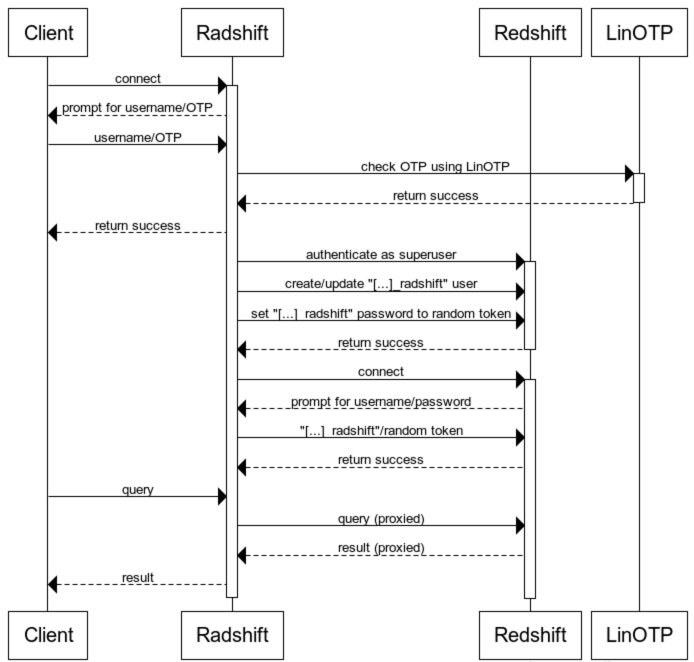

# Radshift
A custom authentication proxy for [AWS Redshift](https://aws.amazon.com/redshift/). Radshift accepts Postgres connections, authenticates users using [LinOTP](https://www.linotp.org/), then proxies through to Redshift. Appropriate Redshift database users are created/updated automatically on-demand.

It uses [femebe](https://github.com/uhoh-itsmaciek/femebe) to do the heavy lifting of the Postgres protocol.

## Motivation
At the time we developed Radshift, AWS Redshift only supported username/password authentication (no certificate or LDAP-based authentication). We wanted to hook into other internal auth systems, so Radshift was born as a temporary solution. There is nothing Redshift-specific about the project except our initial use case.

## Caveats
This code should not be considered production-ready, but may be useful as an example for how to implement similar forms of Postgres proxy functionality. It is meant primarily for human users and has some race conditions if a single user creates multiple concurrent connections in quick succession.

You may want to look at [PgBouncer](https://pgbouncer.github.io/) for a more production-ready proxy.

## How it works


## Building
Building from source requires a working Go environment, but no other special tricks. Vendored dependencies are managed with [dep](https://github.com/golang/dep).

```
go get -u github.com/SimpleFinance/radshift/...
```

## Usage
```
usage: radshift --ssl-cert=<path/to/ssl.crt> --ssl-key=<path/to/ssl.key> --redshift=<[...].redshift.amazonaws.com:5439> --redshift-ca-bundle=<path/to/redshift-ssl-ca-cert.pem> --redshift-user=<user> --redshift-password=<password> --linotp=<https://linotp/auth> --linotp-ca-bundle=<path/to/ca_bundle.pem> [<flags>]

An authenticating proxy for Redshift.

Flags:
      --help                     Show context-sensitive help (also try
                                 --help-long and --help-man).
  -v, --verbose                  enable verbose output.
      --insecure                 Disable authentication and weaken/disable SSL
                                 (dangerous!).
      --listen=127.0.0.1:5432    Interface/port on which to listen.
      --ssl-cert=<path/to/ssl.crt>
                                 Path to SSL certificate in PEM format (default:
                                 $SSL_CRT_PATH).
      --ssl-key=<path/to/ssl.key>
                                 Path to SSL private key in PEM format (default:
                                 $SSL_KEY_PATH).
      --redshift=<[...].redshift.amazonaws.com:5439>
                                 Hostname/IP and port of backend Redshift
                                 cluster.
      --redshift-ca-bundle=<path/to/redshift-ssl-ca-cert.pem>
                                 Path to Redshift Certificate Authority bundle
                                 in PEM format (see
                                 https://docs.aws.amazon.com/redshift/latest/mgmt/connecting-ssl-support.html).
      --redshift-user=<user>     Username for the radshift superuser on the
                                 backend Redshift cluster (default
                                 $REDSHIFT_USER).
      --redshift-password=<password>
                                 Password for the radshift superuser on the
                                 backend Redshift cluster (default:
                                 $REDSHIFT_PASSWORD).
      --user=<username> ...      Allow <username> to connect (after
                                 authenticating to LinOTP).
      --superuser=<username> ...
                                 Treat <username> as a superuser on the backend.
      --linotp=<https://linotp/auth>
                                 URL of LinOTP endpoint for verifying user OTPs
      --linotp-realm="radshift"  LinOTP realm for verifying user OTPs
      --linotp-ca-bundle=<path/to/ca_bundle.pem>
                                 Path to CA bundle for LinOTP in PEM format
                                 (default: $SSL_CA_BUNDLE_PATH).
      --version                  Show application version.
```
